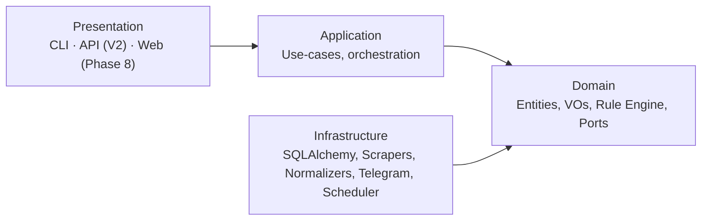

<div align="center">

# Real Estate Alert Platform

**Continuously monitors Spanish real-estate portals and notifies you the moment a new listing
matches a saved search.**

[](https://github.com/alopezmoreira1989/real_estate_tracker/actions/workflows/ci.yml)
[](https://www.python.org/downloads/)
[](https://github.com/psf/black)
[](https://github.com/astral-sh/ruff)
[](https://mypy-lang.org/)
[](LICENSE)

</div>

---

## What this is

You define a **saved alert** — e.g. *"rustic land in Pontevedra, ≤ 20 €/m², at least 3000 m², must
mention water access, must not be occupied"* — once. The platform scrapes the portals you care about,
turns every listing into one **canonical `Property`** regardless of source, evaluates every alert
against every new/changed property, and pushes a **Telegram message** the moment something matches.
No more refreshing five portals by hand every morning.

It's single-user today and **multi-tenant by design** — every piece of data is already scoped to a
user, so adding a second user later is a feature, not a rewrite.

## Motivation

Manually re-running the same searches across Idealista, Fotocasa, Pisos.com, Milanuncios, and
Habitaclia — every day, for several saved criteria — doesn't scale, and portals don't offer
cross-site alerting. This project exists to:

1. **Automate the boring, repeated search** so a genuinely new listing is never missed.
2. **Do it once, correctly** — one canonical data model and one rule engine, instead of ad hoc
   scripts per portal that all reimplement the same filtering logic slightly differently.
3. **Be a portfolio-quality reference** for clean/hexagonal architecture, a data-driven rule engine
   (Specification pattern), and disciplined scraping/normalization — built to be read, not just run.

## Features

### Implemented

- ✅ Clean/hexagonal project skeleton (`domain` / `application` / `infrastructure` / `presentation`)
  with the dependency rule enforced in CI (import-linter).
- ✅ Full quality toolchain: `ruff`, `black`, `mypy --strict`, `pytest` + coverage, pre-commit.
- ✅ Structured logging (`structlog`) and typed settings (`pydantic-settings`).
- ✅ GitHub Actions CI (lint, type-check, import boundaries, tests, Docker build/compose smoke test).
- ✅ Multi-stage Docker image + `docker-compose.yml` (app + a Postgres service defined ahead of V2).

### Planned (see [Roadmap](#roadmap))

- ⏳ Canonical domain model, value objects, and controlled vocabularies (Phase 2)
- ⏳ Specification-based Rule Engine with a pluggable field registry (Phase 3)
- ⏳ Per-portal normalization pipeline (Phase 4)
- ⏳ Idealista scraper + deduplicated search planning (Phase 5)
- ⏳ Telegram notifications via an outbox (Phase 6)
- ⏳ Unattended scheduling — **MVP complete** at the end of Phase 7
- ⏳ Streamlit verification dashboard (Phase 8)
- ⏳ V2: more portals, cross-portal dedup, FastAPI, PostgreSQL, more notification channels
- ⏳ V3: multi-user, full boolean condition builder, price-trend alerts, geo radius search

## Architecture overview

Four layers, one rule: **source-code dependencies point inward only.** The `domain` layer is pure
Python with zero framework imports; everything else depends on it through abstract **ports**, wired
together at a single composition root.



This is deliberately a summary — full diagrams (system context, dependency flow, package
relationships, future deployment) live in
[docs/architecture/09-diagrams.md](docs/architecture/09-diagrams.md), and the reasoning behind every
structural choice is recorded in [docs/architecture/adr/](docs/architecture/adr/). Start with
[docs/architecture/README.md](docs/architecture/README.md) for the full reading order.

## Technology stack

| Layer | Technology |
|-------|-----------|
| Language | Python 3.12+ |
| Domain | Pure Python (`dataclasses`, `enum`) — no framework dependencies |
| Application boundary | Pydantic (DTOs/validation at the edges only) |
| Persistence | SQLAlchemy 2.x + Alembic — SQLite (MVP) → PostgreSQL (V2), see [ADR-003](docs/architecture/adr/003-sqlalchemy-as-persistence.md) |
| Scraping | `httpx` + BeautifulSoup by default, Playwright per portal if required — see [ADR-004](docs/architecture/adr/004-playwright-for-scraping.md) |
| Scheduling | APScheduler, `tenacity` retries, a token-bucket rate limiter, a circuit breaker |
| Notifications | Telegram Bot API (MVP) — see [ADR-005](docs/architecture/adr/005-telegram-notifications.md) |
| Presentation | Typer CLI (MVP) → FastAPI + Streamlit (later) |
| Config & logging | `pydantic-settings`, `structlog` |
| Quality | `ruff`, `black`, `mypy --strict`, `pytest` + coverage, `import-linter`, `pre-commit` |
| Dependency management | `pip` + `setuptools` via `pyproject.toml` — see [ADR-007](docs/architecture/adr/007-poetry-dependency-management.md) |
| CI/CD | GitHub Actions, Docker |

## Repository structure

```
real_estate_tracker/
├── src/real_estate/         # the installable package (src-layout)
│   ├── domain/              # entities, VOs, rule engine, ports — framework-free
│   ├── application/         # use-cases, orchestration, DTOs
│   ├── infrastructure/      # SQLAlchemy, scrapers, normalizers, Telegram, scheduling, config
│   ├── presentation/        # CLI (MVP), API/web (later)
│   ├── composition.py       # the one module that wires adapters -> use-cases
│   └── __main__.py          # process entry point
├── tests/                   # unit / integration / e2e / fixtures — mirrors src/ path-for-path
├── docs/
│   ├── architecture/        # design docs 01-10 + Architecture Decision Records (adr/)
│   ├── planning/            # GitHub Project mirror (epics/milestones/issues)
│   └── roadmap.md           # phased plan, MVP definition, V2/V3 backlog
├── scripts/                 # dev/ops helpers (GitHub Project setup, ...)
├── .github/                 # CI workflow, issue/PR templates
├── Dockerfile, docker-compose.yml
└── pyproject.toml           # dependencies + all tool config (ruff/black/mypy/pytest/import-linter)
```

Full per-folder responsibilities: [docs/architecture/07-folder-structure.md](docs/architecture/07-folder-structure.md).

## Development workflow

- **`main`** is always releasable and protected; it only receives reviewed, CI-green merges.
- **`dev_alm`** is the integration branch — day-to-day work happens here (or in short-lived
  `feature/*` branches off it), verified via CI (and, from Phase 8 onward, the Streamlit dashboard)
  before promoting to `main`.
- Commits follow [Conventional Commits](https://www.conventionalcommits.org/)
  (`type(scope): summary`); PRs are small, focused, and link the issue they close.

Full policy (branch strategy, commit convention, PR expectations, release process):
[CONTRIBUTING.md](CONTRIBUTING.md). Architecture rules a contributor must follow: [CLAUDE.md](CLAUDE.md).

## Getting started

### Prerequisites

- Python **3.12+**
- Git
- (optional) Docker + Docker Compose, if you'd rather not install Python locally

### Installation

```bash
git clone https://github.com/alopezmoreira1989/real_estate_tracker.git
cd real_estate_tracker

python -m venv .venv
source .venv/bin/activate        # Windows: .venv\Scripts\activate

pip install -e ".[dev]"
cp .env.example .env             # then edit .env if you need non-default settings
```

Verify the install:

```bash
python -m real_estate
# 2026-... [info] real_estate_placeholder_start detail='CLI not yet wired, see roadmap Phase 7'
```

### Running with Docker

```bash
docker compose build
docker compose run --rm app
```

`docker-compose.yml` also defines a `postgres` service, present ahead of the V2 migration
([ADR-003](docs/architecture/adr/003-sqlalchemy-as-persistence.md)) — the app doesn't use it yet.

### Running tests

```bash
pytest                    # unit tests + coverage (term-missing report)
pytest --cov-report=html  # HTML coverage report in htmlcov/
```

Tests are organized as `tests/unit` (domain + application, no I/O), `tests/integration`
(repositories, scrapers against recorded fixtures), and `tests/e2e` (full alert cycle against a
seeded DB) — see CLAUDE.md §8 for the full testing philosophy.

### Static analysis

```bash
ruff check .        # lint + import order
black --check .     # formatting
mypy                # strict type checking
lint-imports         # architecture boundary enforcement (see below)
```

Or run everything pre-commit would run, on the whole repo:

```bash
pre-commit run --all-files
```

### Dependency (architecture boundary) rules

Enforced by [import-linter](https://import-linter.readthedocs.io/) in CI and locally via
`lint-imports`:

- `domain` imports **nothing** but the standard library — not even Pydantic or SQLAlchemy.
- `application` may depend on `domain` only.
- `infrastructure` may depend on `domain` (and `application` where it implements a use-case port).
- `presentation` may depend on `application` (and `domain` types) — never `infrastructure` directly.
- Nothing depends on `infrastructure` or `presentation` except the composition root.

Every contract is documented inline in `pyproject.toml` under `[tool.importlinter]`, and the reasoning
behind enforcing it mechanically (rather than by review discipline alone) is
[ADR-006](docs/architecture/adr/006-import-linter.md).

### CI

Every push/PR to `main` or `dev_alm` runs, via [.github/workflows/ci.yml](.github/workflows/ci.yml):

1. **Quality job** — `ruff`, `black --check`, `mypy --strict`, `lint-imports`, `pytest` with coverage
   (uploaded as an artifact).
2. **Docker job** — builds the image and runs it through `docker compose` as a smoke test.

Both must pass before a PR merges.

## Roadmap

Phase-by-phase plan, from empty repo to MVP, then V2/V3: **[docs/roadmap.md](docs/roadmap.md)**. Each
phase is a GitHub milestone; issues carry `epic:*`/`type:*`/`complexity:*` labels — see
[docs/planning/README.md](docs/planning/README.md) for how the GitHub Project is organized.

```mermaid
flowchart LR
    P1["Phase 1\nFoundation & Tooling ✅"] --> P15["Phase 1.5\nProject Hardening ✅"]
    P15 --> P2["Phase 2\nDomain & Persistence"]
    P2 --> P3["Phase 3\nRule Engine"]
    P3 --> P4["Phase 4\nNormalization"]
    P4 --> P5["Phase 5\nScraper & Search"]
    P5 --> P6["Phase 6\nNotifications"]
    P6 --> P7["Phase 7\nScheduler — MVP"]
    P7 --> P8["Phase 8\nDashboard"]
    P8 --> V2["V2\nBreadth & Robustness"]
    V2 --> V3["V3\nProduct & Scale"]
```



## Current project status

**Phase 1.5 complete** — the skeleton, tooling, CI, Docker, and documentation are hardened; no
domain/business logic exists yet by design. **Phase 2 (Domain & Persistence) is next.** See the
[GitHub milestones](https://github.com/alopezmoreira1989/real_estate_tracker/milestones) for
issue-level status.

## Future phases

- **V2 — Breadth & robustness**: additional scrapers (Fotocasa, Pisos.com, Habitaclia, Milanuncios),
  cross-portal dedup, FastAPI, email/Discord notifiers, PostgreSQL, query-widening dedup.
- **V3 — Product & scale**: multi-user sign-up with fairness/quotas, full boolean condition builder,
  price-drop/market-trend alerts, geo radius search, WhatsApp/push channels, observability.

Architectural risk assessment for each of these: [docs/architecture/10-future-proofing.md](docs/architecture/10-future-proofing.md).

## Contributing

Contributions, issues, and questions are welcome. Please read
**[CONTRIBUTING.md](CONTRIBUTING.md)** (branch strategy, commit convention, PR process) and
**[CLAUDE.md](CLAUDE.md)** (the architecture rules every change must respect) before opening a PR.
Also see [CODE_OF_CONDUCT.md](CODE_OF_CONDUCT.md) and, for local setup details,
[DEVELOPMENT.md](DEVELOPMENT.md).

## Security

Please report security concerns as described in **[SECURITY.md](SECURITY.md)** rather than in a
public issue.

## License

[MIT](LICENSE) © Alejandro Lopez Moreira
