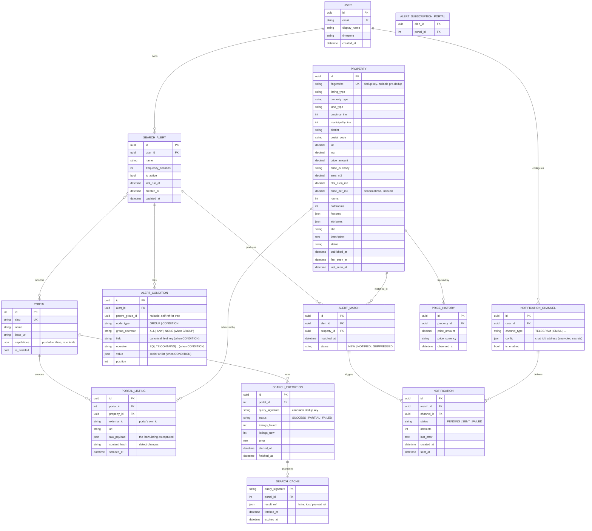

# 03 — Database Design (Schema + ERD)

> Status: **Draft for review** · Owner: Architecture · Depends on:
> [02-domain-model.md](02-domain-model.md)

Relational design for the platform. SQLite for the MVP, PostgreSQL later — the SQLAlchemy models are
identical; only dialect-specific types (JSON, timestamps, partial indexes) differ and are handled by
SQLAlchemy. Migrations via **Alembic** from day one.

---

## 1. Entity–Relationship Diagram

---

## 2. Table notes, constraints & indexes

### `user`
- `email` **UNIQUE**. Multi-tenant root; single row for MVP.

### `search_alert`
- FK `user_id` → `user(id)` `ON DELETE CASCADE`.
- `frequency_seconds` CHECK ≥ 60 (guard against hammering portals).
- Index `(is_active, last_run_at)` — the scheduler's hot query: "which active alerts are due?".

### `alert_condition` (self-referential tree)
- One table stores both **groups** and **leaf conditions** (`node_type`), with `parent_group_id`
  self-FK to represent the `RuleGroup` tree from doc 02/04.
- CHECK: when `node_type='CONDITION'` then `field`/`operator`/`value` NOT NULL and `group_operator`
  NULL; when `'GROUP'` the inverse.
- Index `(alert_id, parent_group_id, position)` to reconstruct the tree in order.
- Rationale for one-table-tree over EAV or JSON blob: it is queryable ("which alerts filter on
  `province`?"), migratable, and still fully generic (D1). A JSON blob is the rejected alternative —
  opaque to SQL and to analytics.

### `alert_subscription_portal` (join)
- Composite PK `(alert_id, portal_id)`. Resolves the N—M "alert monitors portals".

### `portal`
- `slug` UNIQUE (e.g. `idealista`). `capabilities` JSON declares which canonical fields the portal
  can filter **server-side** (used by the Search Engine to build pushable queries) and its rate
  limits.

### `property` (canonical)
- `fingerprint` UNIQUE (nullable until dedup runs) — see §4.
- **Denormalized `price_per_m2`** stored + indexed because it is the most common numeric filter;
  kept consistent by the write path (never edited by hand).
- Location stored as INE codes (`province_ine`, `municipality_ine`) + text `district`/`postal_code`.
- Composite indexes for the engine's pushable pre-filter:
  - `(province_ine, property_type, listing_type)`
  - `(property_type, price_per_m2)`
  - `(province_ine, price_amount)`
  - partial/functional index on `land_type` where `property_type='LAND'` (PostgreSQL).
- `features`/`attributes` as JSON (JSONB in PostgreSQL → GIN index later for attribute filters).
- `last_seen_at` drives staleness/`INACTIVE` transitions.

### `portal_listing`
- **UNIQUE `(portal_id, external_id)`** — the natural key; upsert target.
- `content_hash` detects "listing changed since last scrape" cheaply (skip re-normalize if equal).
- `raw_payload` persists the `RawListing` for replay/debugging and re-normalization when a mapping
  improves.
- FK `property_id` → `property(id)`.

### `price_history`
- Append-only. Index `(property_id, observed_at)`. A new row is written **only when the price
  changes** (not every scrape), keeping the series meaningful.

### `alert_match`
- **UNIQUE `(alert_id, property_id)`** — the idempotency guarantee: a property notifies an alert at
  most once (D-idempotency). Re-evaluation is safe.
- Index `(status, matched_at)` for the dispatcher.

### `notification` (outbox)
- FK `match_id`, `channel_id`. `status` state machine `PENDING → SENT | FAILED`; `attempts`,
  `last_error` for retry/backoff.
- Index `(status, created_at)` — dispatcher polls pending.
- Decouples detection from delivery (D4). Delivery failures never corrupt match detection.

### `notification_channel`
- `config` JSON; secrets (bot tokens, chat ids treated as sensitive) **encrypted at rest**.
- UNIQUE `(user_id, channel_type, config->>identifier)` to prevent duplicate channels.

### `search_execution`
- Observability/audit of every scrape: signature, status, counts, error, timing. Index
  `(portal_id, started_at)`. Feeds dashboards and rate-limit decisions.

### `search_cache`
- PK = `query_signature`. `expires_at` gives TTL-based reuse (D3). The dedup engine reads this before
  scheduling a scrape.

---

## 3. Referential integrity summary

- `ON DELETE CASCADE`: `user → search_alert → alert_condition`, `search_alert → alert_match`,
  `alert_match → notification`, `user → notification_channel → notification`.
- `RESTRICT`/`SET NULL`: never hard-delete a `property` referenced by history/matches; mark
  `INACTIVE` instead (soft state via `status`).
- All FKs enforced (SQLite: `PRAGMA foreign_keys=ON` at connect).

---

## 4. Cross-portal deduplication (the `fingerprint`)

The same physical flat may be listed on Idealista *and* Fotocasa. Options:

- **A — 1:1 (defer dedup)**: each `PortalListing` maps to its own `Property`. Simplest; duplicates
  visible to the user. `fingerprint` NULL.
- **B — canonical merge (proposed, phased)**: compute `fingerprint` from stable signals
  (normalized address/geo + area + rooms + property_type, price as a weak signal). Listings with the
  same fingerprint collapse to one `Property` with N `PortalListing`s.

**Recommendation:** ship **A** for the MVP (schema already supports both — `fingerprint` nullable,
`PortalListing.property_id` FK present), and enable **B** in a later phase behind the same schema
with a backfill migration. This is doc 01 Q1 / doc 02 Q2.

---

## 5. SQLite → PostgreSQL portability

| Concern | MVP (SQLite) | Later (PostgreSQL) |
|---------|--------------|--------------------|
| UUID PK | stored as `CHAR(36)`/`BLOB` | native `uuid` |
| JSON columns | `JSON` (text) | `JSONB` + GIN indexes |
| Partial indexes | limited | full support (land_type, status) |
| Concurrency | single-writer; short transactions, WAL mode | MVCC |
| Full-text (keyword filters) | `LIKE`/FTS5 | `tsvector`/`pg_trgm` |

Keyword conditions (`CONTAINS "water"`) run in the **rule engine in Python** for the MVP (data
volumes are small and it keeps behavior identical across DBs); they can be pushed to FTS later as an
optimization without changing the domain contract.

---

## 6. Open questions for review

1. Confirm dedup **Option A for MVP** (§4).
2. UUID vs bigint surrogate keys — proposed UUID for merge-friendliness and multi-tenant opacity;
   accept the slight index-size cost?
3. Retain `raw_payload` indefinitely or prune after N days? (Proposed: keep latest per listing +
   prune older execution payloads on a schedule.)
