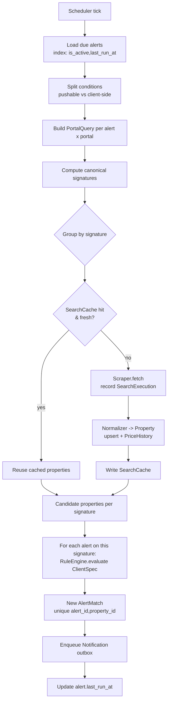

# 06 — Search Engine & Scheduling Strategy

> Status: **Draft for review** · Owner: Architecture · Depends on:
> [04-alert-rule-engine.md](04-alert-rule-engine.md), [03-database.md](03-database.md)

Driver **D3**: if ten alerts search Pontevedra, we must **not** scrape Pontevedra ten times. This
document defines how alerts become the *fewest possible* portal scrapes, how results are cached and
reused (across alerts and across users), and how work is scheduled politely.

---

## 1. The key idea: separate *what to fetch* from *what to match*

Every alert condition is classified into one of two buckets by the portal's declared
`capabilities` (doc 03 `portal.capabilities`):

- **Portal-pushable** — the portal can filter it server-side, so it shrinks what we download:
  `province`, `property_type`, `listing_type`, coarse `price` range, coarse `area` range.
- **Client-side** — evaluated by the Rule Engine on normalized `Property` objects after fetching:
  keywords (`CONTAINS "water"`), `price_per_m2`, fine thresholds, tri-state features, negations.

An alert therefore yields:

```
Alert ─▶ PortalQuery (pushable subset, per portal)  +  ClientSpec (full Specification, doc 04)
```

Two alerts with *different* client-side conditions but the *same* pushable subset **share one
scrape**. The pushable subset is intentionally coarse so it can be shared widely; precision is
recovered client-side by the Rule Engine.

---

## 2. Canonical query signature (the dedup key)

Each `PortalQuery` is reduced to a **canonical signature**: portal + normalized, sorted pushable
parameters, hashed.

```
sig = hash(portal_slug + sorted(normalized_pushable_params))
```

Because it is canonical (sorted, unit-normalized, defaulted), two alerts that mean the same portal
search always produce the **same** signature — even across different users. The signature is the key
of `search_cache` and the `query_signature` of `search_execution` (doc 03).

> **Widening for reuse (optional optimization):** a query for `price ≤ 200k` is a *subset* of
> `price ≤ 300k`. A later phase can fetch a widened superset once and let each alert filter down
> client-side, collapsing near-duplicate signatures. MVP keeps exact-signature dedup only —
> simpler and already eliminates the "10× Pontevedra" case.

---

## 3. The alert cycle, deduplicated



One scrape per unique signature per cycle, fanned out to every alert that shares it. This is the
concrete realization of D3 and simultaneously the multi-tenant win (doc 01 §9): dedup spans users
because `Property`/`SearchCache` are global.

---

## 4. Caching model

- `search_cache` keyed by signature, holding references to the resulting properties + `fetched_at`
  and `expires_at` (TTL).
- **Freshness policy**: TTL derived from the *tightest* notification frequency among alerts sharing
  the signature (e.g. if any alert wants 15-min freshness, TTL ≤ 15 min). A looser alert reuses a
  fresher-than-needed cache for free.
- **New-listing detection** relies on `portal_listing (portal_id, external_id)` upsert +
  `content_hash` (doc 03): only genuinely new/changed listings become fresh candidates, so the Rule
  Engine mostly evaluates deltas, not the whole result set.

---

## 5. Scheduling strategy (APScheduler)

- **Due-set model, not one-timer-per-alert.** A single recurring "planner" job (e.g. every minute)
  loads alerts whose `last_run_at + frequency ≤ now` (hot index from doc 03), groups them by
  signature, and dispatches scrape jobs. This avoids thousands of individual timers and makes dedup
  natural (you see the whole due set at once).
- **Per-portal worker pool + rate limiting.** Each portal has a concurrency cap and a min-delay
  between requests (from `portal.capabilities`). A token-bucket/leaky-bucket limiter enforces
  politeness; scrape jobs for a portal queue behind its limiter.
- **Coalescing & jitter.** If a scrape for a signature is already in-flight, later alerts attach to
  its result instead of launching a second scrape. Small random jitter avoids thundering-herd on
  round minutes.
- **Isolation & resilience.** One portal failing (timeout, ban, layout change) fails only that
  signature's `SearchExecution` (status `FAILED`), is retried with backoff (`tenacity`), and — after
  repeated failures — trips a **circuit breaker** that pauses that portal without affecting others
  (D7).
- **Notification dispatch is a separate job** polling the outbox (doc 03 `notification.status`),
  honoring per-alert frequency and per-channel rate limits. Scraping cadence ≠ notification cadence.

---

## 6. Backpressure & fairness (multi-user readiness)

- Global and per-portal concurrency caps bound total load regardless of how many alerts/users exist.
- The planner processes the due set **by signature**, so N users wanting the same search cost one
  scrape — cost scales with *distinct searches*, not with *users* or *alerts*.
- A per-user quota (max active alerts / min frequency) is a config knob, off for the single-user MVP,
  ready for later.

---

## 7. What runs where (layer placement)

| Concern | Layer |
|---------|-------|
| Split pushable/client-side, signature computation, dedup, candidate→alert fan-out | **Application** (`RunAlertCycle` use-case) — it's orchestration, no business rules |
| "Does this property satisfy the alert?" | **Domain** (Rule Engine, doc 04) |
| Actual HTTP/scrape, rate limiter, cache/DB reads-writes, APScheduler jobs | **Infrastructure** |
| Portal `capabilities` (which fields are pushable) | **Infrastructure config**, read by Application |

The scheduler is infrastructure and triggers the Application use-case; it holds **no** matching logic.

---

## 8. Open questions for review

1. MVP dedup = **exact signature only** (defer subset/superset widening)? (Proposed: yes.)
2. Cache result storage: reference property ids (proposed) vs snapshot payloads?
3. Planner interval and default per-portal rate limits — set conservative defaults now
   (e.g. plan every 60s; ≥1 req/2s per portal) and tune per portal via `capabilities`?
4. Circuit-breaker thresholds (failures before pausing a portal, cooldown length) — config-driven.
