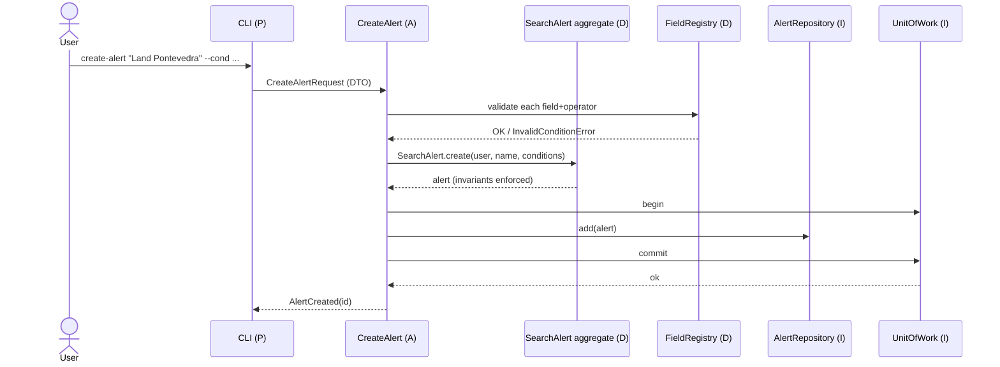
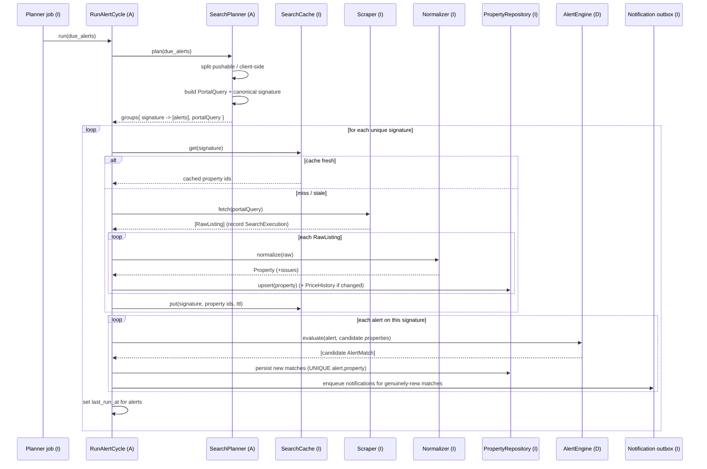
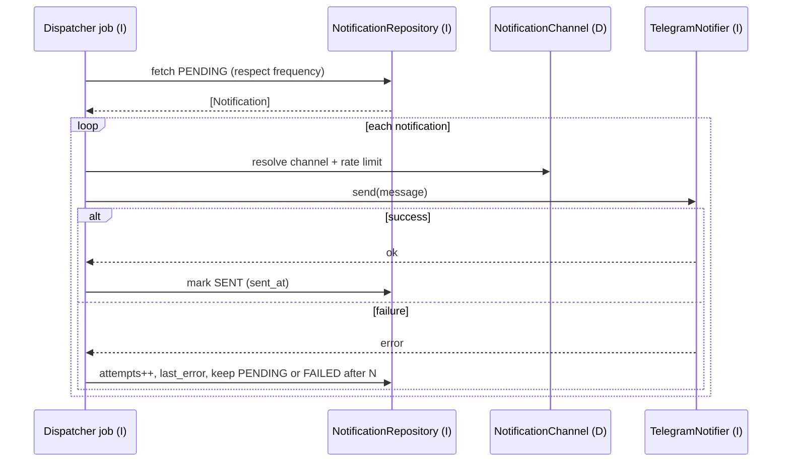

# 08 — Sequence Diagrams

> Status: **Accepted** · Owner: Architecture · Depends on:
> [06-search-scheduler.md](06-search-scheduler.md)

Runtime behavior of the key flows. Actors are grouped by layer (doc 01): **P**resentation,
**A**pplication, **D**omain, **I**nfrastructure.

---

## 1. Create an alert



Field/operator validity is checked **before** persistence; a malformed alert never reaches the DB.

---

## 2. Alert cycle — the core flow (dedup + evaluate + enqueue)



Note the two dedup wins: **one scrape per signature** (D3) and **idempotent matches** (UNIQUE
constraint) so re-runs never double-notify.

---

## 3. Notification dispatch (separate job)



Delivery lives entirely in infrastructure; the domain only produced `AlertMatch`. Adding Email/
Discord later is a new `Notifier` adapter + channel type — no change to detection or dispatch loop.

---

## 4. Scraper failure isolation

```mermaid
sequenceDiagram
    participant UC as RunAlertCycle (A)
    participant Scr as FotocasaScraper (I)
    participant CB as CircuitBreaker (I)
    participant Log as structlog (I)

    UC->>CB: allow(fotocasa)?
    alt breaker open
        CB-->>UC: blocked
        UC->>Log: warn portal paused; skip signature
    else allowed
        UC->>Scr: fetch(query)  [tenacity retry+backoff]
        alt success
            Scr-->>UC: [RawListing]
            UC->>CB: record success
        else repeated failure
            Scr-->>UC: error
            UC->>CB: record failure (maybe open breaker)
            UC->>Log: error SearchExecution=FAILED
            Note over UC: cycle continues with other portals (D7)
        end
    end
```

One portal breaking never halts the cycle; other signatures/portals proceed.
