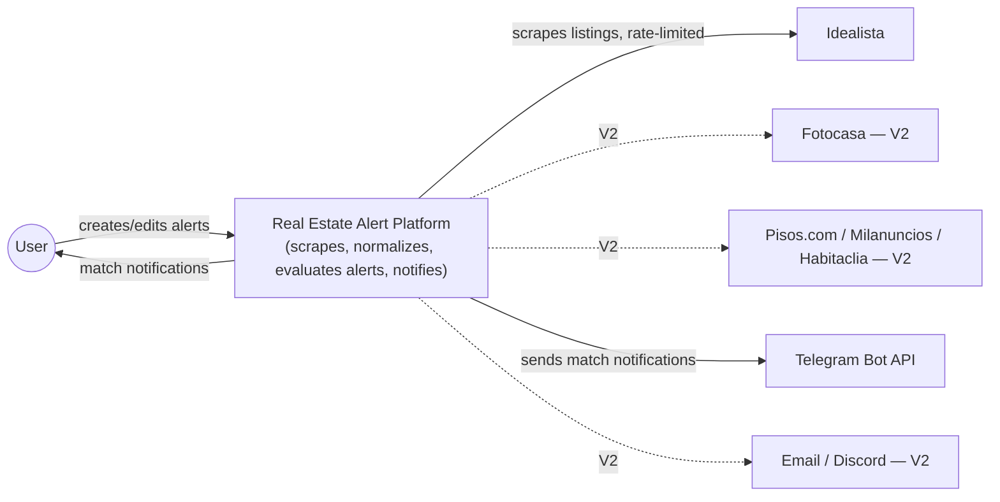
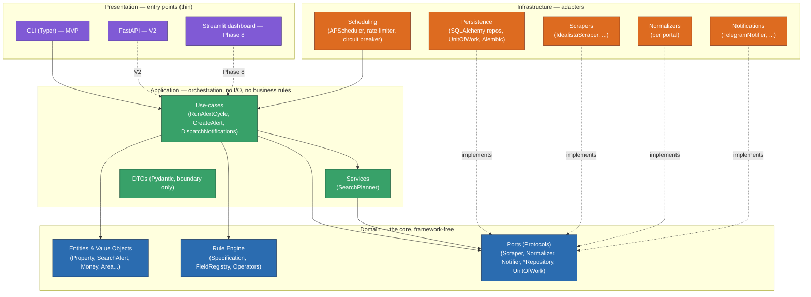
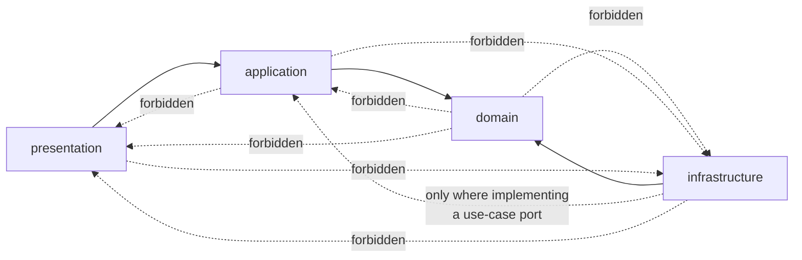
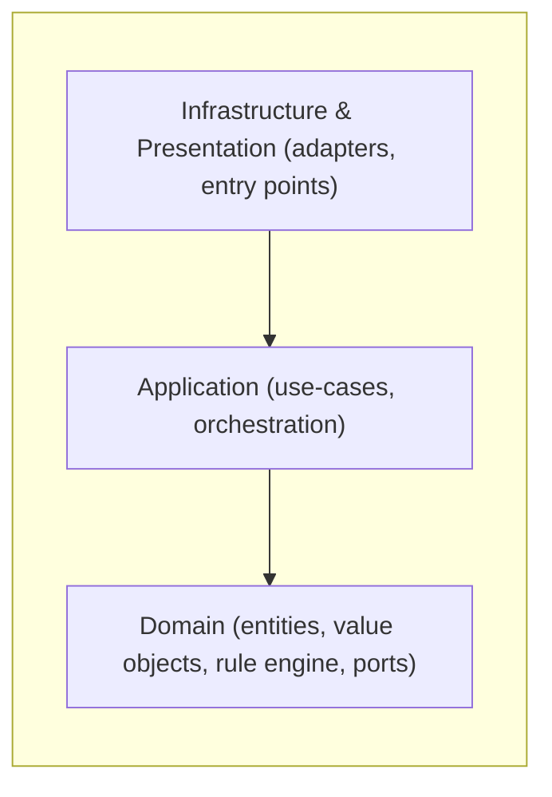
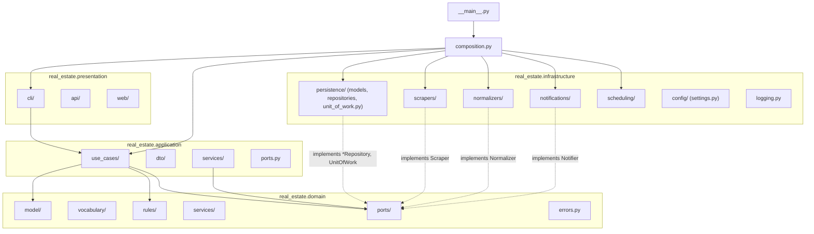
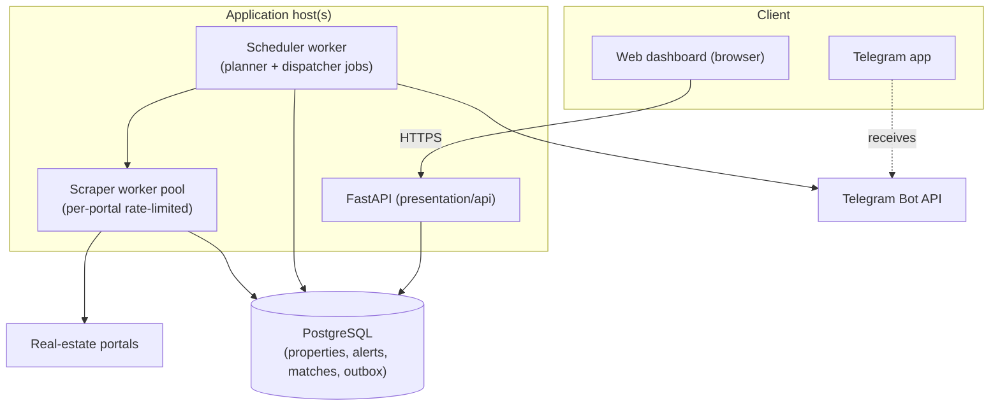

# 09 — System Diagrams

> Status: **Accepted** · Owner: Architecture · Depends on: [01-architecture.md](01-architecture.md),
> [07-folder-structure.md](07-folder-structure.md)

Structural views of the system, complementing the runtime sequence diagrams in
[08-sequence-diagrams.md](08-sequence-diagrams.md). Added in Phase 1.5 to make the architecture's
shape visible at a glance, not just describable in prose.

---

## 1. System context

Who and what the platform talks to, at the coarsest level.

The platform owns no user-facing surface of its own yet beyond a CLI (MVP) — everything the user
"sees" arrives via the notification channel. A REST API and web dashboard are V2/Phase 8 additions;
see [10-future-proofing.md](10-future-proofing.md).

---

## 2. Layered (Clean/Hexagonal) architecture

The dependency rule from [01-architecture.md](01-architecture.md) §3, as a diagram: arrows show the
*allowed* direction of source-code dependency. Nothing points into the domain from outside it.

Solid arrows are compile-time `import` dependencies (source code). Dashed arrows are *runtime*
relationships wired through dependency injection at the composition root — infrastructure adapters
never appear as an import inside application or domain code; they satisfy a `Port` `Protocol` and are
handed to a use-case by `composition.py`.

---

## 3. Dependency flow (what may import what)

The same rule, expressed as the exact contract enforced by import-linter
([ADR-006](adr/006-import-linter.md), `pyproject.toml` `[tool.importlinter]`).

`composition.py` is deliberately outside this graph: it is the one module allowed to import
*every* concrete class (every adapter and every use-case) in order to wire them together. That
exemption is why it exists as a single, small, reviewable file rather than being implicit.

---

## 4. Clean Architecture (concentric view)

The traditional "onion" view of the same rule — dependencies always point toward the center.

Read the arrows as "depends on." `Domain` sits at the center depending on nothing project-specific;
`Application` depends only on `Domain`; `Infrastructure`/`Presentation` depend on both inner rings
but never on each other directly (§3).

---

## 5. Package relationships (current, Phase 1 skeleton)

The actual `src/real_estate/` packages as they exist today (doc 07), and which ports each
infrastructure package will implement once Phase 2+ adds behavior.

Every `i_*` package box is currently an empty placeholder (Phase 1) — this diagram is the map Phase 2
onward fills in, package by package, without changing its shape.

---

## 6. Future deployment (V2 target)

The MVP runs as a single process (CLI + scheduler) against SQLite on one machine. This is the
target shape once the roadmap's V2 items (FastAPI, PostgreSQL, multiple portals) land — **nothing
here is built yet**; see [10-future-proofing.md](10-future-proofing.md) for what today's design does
to keep this reachable without a rewrite.

Every box in this diagram already has a named seam in today's architecture: `API` is a new
`presentation/api` package calling the same use-cases the CLI calls today; `Scheduler`/`ScraperWorkers`
are the same `infrastructure/scheduling` + `infrastructure/scrapers` packages running as separate
processes instead of one; `PostgreSQL` is [ADR-003](adr/003-sqlalchemy-as-persistence.md)'s planned
migration, not a new decision.
